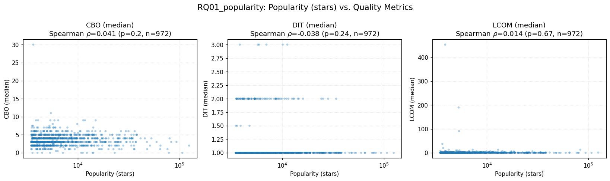
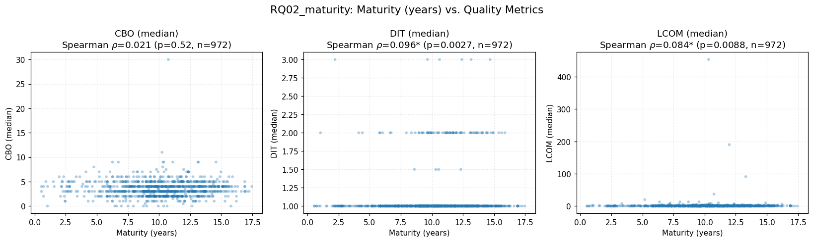
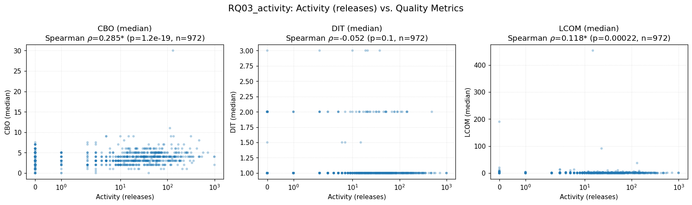
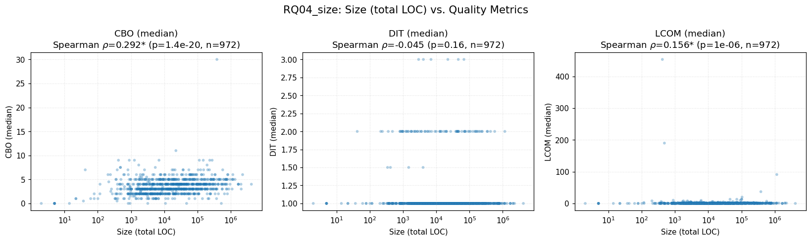

# Laboratório 02 — Um estudo das características de qualidade de sistemas Java

**Disciplina:** Laboratório de Experimentação de Software
**Curso:** Engenharia de Software — PUC Minas
**Período:** 6º
**Professor:** João Paulo Carneiro Aramuni

---

## 1. Introdução

No processo de desenvolvimento colaborativo de software open-source, em que
diversos desenvolvedores contribuem em partes diferentes do código, atributos
de qualidade interna como modularidade, manutenibilidade e coesão estão sob
pressão constante. Este estudo analisa os **top-1.000 repositórios Java mais
populares do GitHub**, calculando métricas de qualidade através da ferramenta
[CK](https://github.com/mauricioaniche/ck) e correlacionando-as com
características de processo dos repositórios.

### 1.1. Questões de Pesquisa

- **RQ01.** Qual a relação entre a **popularidade** dos repositórios e as suas
  características de qualidade?
- **RQ02.** Qual a relação entre a **maturidade** dos repositórios e as suas
  características de qualidade?
- **RQ03.** Qual a relação entre a **atividade** dos repositórios e as suas
  características de qualidade?
- **RQ04.** Qual a relação entre o **tamanho** dos repositórios e as suas
  características de qualidade?

### 1.2. Hipóteses Informais

Antes de realizar a análise, elaboramos as seguintes expectativas sobre os
resultados, que serão comparadas com os valores obtidos na Seção 4
(Discussão).

- **H-RQ01 (popularidade × qualidade).** Repositórios mais populares tendem a
  apresentar melhor qualidade interna, pois atraem contribuidores mais
  experientes, recebem revisões de código mais rigorosas e enfrentam maior
  pressão pública por clareza. Esperamos **correlação negativa fraca** entre
  número de estrelas e CBO/LCOM (mais estrelas → menor acoplamento, maior
  coesão) e correlação quase nula com DIT, já que profundidade de herança é
  mais um estilo arquitetural do que consequência de popularidade.

- **H-RQ02 (maturidade × qualidade).** Projetos mais antigos acumulam código
  legado, refatorações inconsistentes e padrões de Java pré-2010 (uso mais
  agressivo de herança em vez de composição). Esperamos **correlação positiva
  fraca a moderada** entre idade do repositório e CBO/LCOM, e correlação
  positiva também com DIT, já que hierarquias mais profundas eram comuns em
  código Java antigo.

- **H-RQ03 (atividade × qualidade).** Repositórios com mais releases
  pressupõem manutenção ativa, CI/CD e disciplina de código, incluindo
  refatoração contínua. Esperamos **correlação negativa fraca** entre
  número de releases e CBO/LCOM. Para DIT a expectativa é de correlação
  quase nula, já que a estrutura de herança geralmente é estabelecida cedo e
  raramente muda durante a vida útil do projeto.

- **H-RQ04 (tamanho × qualidade).** Repositórios maiores carregam mais
  complexidade inerente, mais dependências entre módulos e mais chance de
  terem "god classes". Esperamos **correlação positiva moderada** entre LOC
  total e CBO, e também positiva com LCOM (mais código → classes maiores →
  menor coesão). Para DIT esperamos correlação fraca-positiva, já que
  projetos maiores tendem a desenvolver hierarquias de tipos mais extensas.

### 1.3. Sumário dos achados

Após analisar 972 repositórios (97,2% dos 1.000 coletados; 28 excluídos
por falhas de tooling ou ausência de código Java real — ver §5), a
análise de correlação de Spearman revelou:

- **Popularidade não prediz qualidade interna.** Todas as três correlações
  de RQ01 ficaram abaixo de |ρ|=0.05 e nenhuma foi significativa.
- **Maturidade tem efeito residual.** Correlações fracas mas
  significativas entre idade e DIT (ρ = 0.10) / LCOM (ρ = 0.08); CBO
  independente da idade.
- **Atividade e tamanho produzem efeitos numericamente idênticos**
  (ρ ≈ 0.29 para CBO, ρ ≈ 0.12-0.16 para LCOM). Como
  ρ(releases, loc_total) = 0.467, o aparente efeito de atividade é
  amplamente um efeito de tamanho disfarçado.
- **DIT é insensível a praticamente tudo.** De 12 correlações testadas,
  apenas uma envolvendo DIT foi significativa — e mesmo assim com
  magnitude desprezível. A profundidade de herança é uma decisão
  arquitetural precoce e estável.

Três das quatro hipóteses iniciais foram **refutadas ou parcialmente
refutadas** pelos dados; apenas H-RQ04 (tamanho) foi confirmada. Detalhes
quantitativos e interpretação completa em §3 e §4.

---

## 2. Metodologia

### 2.1. Seleção dos repositórios

Coletamos os 1.000 repositórios Java mais populares do GitHub via a
**API GraphQL v4**, usando o query `language:Java sort:stars-desc`. Para cada
repositório armazenamos: nome, proprietário, URL, número de estrelas,
`createdAt`, contagem de releases, linguagem primária e branch default. A
idade do repositório é calculada como `(hoje − createdAt)` em anos.

### 2.2. Definição das métricas

#### Métricas de processo

| Métrica | Definição | Fonte |
|---|---|---|
| Popularidade | Número de stargazers | GitHub GraphQL (`stargazerCount`) |
| Maturidade | Anos desde a criação do repositório | GitHub GraphQL (`createdAt`) |
| Atividade | Número total de releases publicadas | GitHub GraphQL (`releases.totalCount`) |
| Tamanho | Soma das LOC de todas as classes analisadas por CK | CK (`class.csv`, coluna `loc`) |

#### Métricas de qualidade

Extraídas da ferramenta **CK** sobre o código-fonte de cada repositório:

| Métrica | Significado |
|---|---|
| **CBO** (Coupling Between Objects) | Número de classes das quais a classe depende |
| **DIT** (Depth of Inheritance Tree) | Profundidade da classe na árvore de herança |
| **LCOM** (Lack of Cohesion of Methods) | Ausência de coesão entre os métodos da classe |

### 2.3. Pipeline de coleta

1. **Busca** dos 1.000 repositórios via GraphQL, com paginação por cursor
   (50 por página, 20 requisições). Dados normalizados em
   `output/repositories_list.csv`.
2. **Clone e análise** em paralelo, via `ThreadPoolExecutor` com N workers
   (default 4). Cada worker executa, para um repositório:
   - `git clone --depth 1 <owner>/<name>`
   - `java -jar ck.jar <clone> false 0 false <outdir>/`
   - Parse do `class.csv` e sumarização por repositório
   - Remoção do clone após conclusão (ou em caso de falha)
3. **Escrita incremental** em `output/metrics_summary.csv` via um writer
   thread-safe que faz `flush()` após cada linha, garantindo que uma
   interrupção não perca o progresso já coletado.
4. **Retomada** automática: antes de processar, o pipeline lê o CSV
   existente e pula repositórios já presentes.

### 2.4. Sumarização por repositório

CK produz um arquivo `class.csv` com uma linha por classe (incluindo classes
internas, anônimas, interfaces e enums). Para cada repositório calculamos,
sobre todas as classes:

- `CBO_mean`, `CBO_median`, `CBO_stdev`
- `DIT_mean`, `DIT_median`, `DIT_stdev`
- `LCOM_mean`, `LCOM_median`, `LCOM_stdev`
- `loc_total` (soma de LOC das classes — métrica de Size para RQ04)
- `loc_mean`, `loc_median`, `loc_stdev`

O relatório utiliza como **métrica central para as correlações a mediana**,
não a média. Ver justificativa em §2.5.

### 2.5. Decisões metodológicas

Três escolhas merecem ser explicitadas porque afetam a interpretação dos
resultados:

1. **Mediana em vez de média para LCOM.** Durante a validação do pipeline,
   observamos que classes de teste de grandes projetos (por exemplo,
   `JsonReaderTest` em `google/gson`, com 158 métodos e LCOM=12403) dominam
   completamente a média repo-level. A mediana representa a classe típica
   de forma muito mais robusta a outliers e é o resumo adotado por estudos
   empíricos similares. Usamos mediana também para CBO e DIT por consistência.

2. **Inclusão de classes de teste.** CK não distingue automaticamente classes
   de produção de classes de teste. Seguindo a prática padrão da literatura
   empírica, analisamos todo o código Java do repositório. Isso infla os
   valores absolutos de LOC e LCOM, mas de forma relativamente uniforme
   entre os repositórios, o que não compromete as análises de correlação.

3. **Definição de Size via `loc_total` sem contar comentários.** O PDF do
   laboratório cita "linhas de código (LOC) e linhas de comentários" como
   métrica de tamanho. CK não gera, no seu `class.csv`, uma contagem de
   linhas de comentários diretamente — os comentários estão distribuídos
   entre colunas relacionadas a Javadoc/documentação de métodos. Optamos
   por utilizar `loc_total` (soma da coluna `loc` de todas as classes) como
   proxy de Size. Para correlação esse proxy é adequado, porque LOC e
   comentários crescem juntos em projetos maiores.

### 2.6. Análise estatística

- **Teste de correlação:** **Spearman's ρ**, não Pearson. As distribuições
  de estrelas, releases e LOC total seguem cauda pesada (power-law) e
  Spearman só assume monotonicidade, não linearidade. Spearman também é
  robusto a outliers, o que é essencial para a natureza destes dados.
- **Nível de significância:** α = 0.05. Resultados com p < 0.05 são
  marcados como estatisticamente significativos nas tabelas e nos gráficos.
- **Visualização:** scatter plots em escala log (exceto idade, que é
  aproximadamente uniforme) para acomodar a dispersão das distribuições.

---

## 3. Resultados

Dos 1.000 repositórios coletados, **980** foram processados com sucesso pelo
pipeline (20 falharam, detalhados em §5). Desses, **972** foram incluídos
na análise de correlação — 8 repositórios adicionais foram descartados por
terem `ck_class_count == 0` ou `loc_total == 0` (repositórios como
`Snailclimb/JavaGuide`, `doocs/advanced-java`, etc., que são listas de
estudo/tutoriais em Markdown com apenas um ou dois arquivos Java de 2-5 LOC).

### 3.1. Estatísticas descritivas gerais

Valores agregados sobre os **972 repositórios** analisados:

| Métrica | Média | Mediana | Desvio padrão | Mínimo | Máximo |
|---|---:|---:|---:|---:|---:|
| **stars** | 9 429 | 5 786 | 10 710 | 3 466 | 125 045 |
| **releases** | 40.9 | 11 | 89.9 | 0 | 1 000 |
| **age_years** | 10.1 | 10.3 | 3.16 | 0.55 | 17.5 |
| **loc_total** | 92 272 | 15 374 | 255 470 | 2 | 4 165 269 |
| **ck_class_count** | 1 614 | 348 | 3 782 | 1 | 44 670 |
| **CBO (média por classe)** | 5.38 | 5.33 | 1.87 | 0 | 21.9 |
| **CBO (mediana por classe)** | 3.56 | 3.00 | 1.72 | 0 | 30 |
| **CBO (desvio por classe)** | 6.21 | 6.02 | 2.68 | 0 | 20.8 |
| **DIT (média por classe)** | 1.46 | 1.39 | 0.35 | 1 | 4.39 |
| **DIT (mediana por classe)** | 1.09 | 1.00 | 0.31 | 1 | 3 |
| **DIT (desvio por classe)** | 1.09 | 0.76 | 2.34 | 0 | 52.98 |
| **LCOM (média por classe)** | 118.9 | 24.5 | 1 741.6 | 0 | 54 025 |
| **LCOM (mediana por classe)** | 1.47 | 0.00 | 16.1 | 0 | 453.5 |
| **LCOM (desvio por classe)** | 3 275.6 | 129.6 | 75 605 | 0 | 2 351 475 |

**Observações importantes sobre as distribuições:**

1. As três variáveis de processo `stars`, `releases` e `loc_total` são
   fortemente **enviesadas à direita (heavy-tailed / power-law)**: a média é
   muito maior que a mediana e o valor máximo é 1-3 ordens de grandeza
   acima do terceiro quartil. Isso justifica o uso do teste de Spearman
   (não-paramétrico) e escala logarítmica nos gráficos.

2. A maturidade (`age_years`) é aproximadamente uniforme entre ~5 e ~15 anos,
   com mediana 10.3 anos — a amostra é composta quase inteiramente por
   projetos já maduros.

3. **A mediana de LCOM por repositório é 0.0** — mais da metade dos
   repositórios tem pelo menos 50% das classes com coesão perfeita. Ao
   mesmo tempo, o desvio padrão intra-repo vai a ~2,3 milhões. Essa
   diferença brutal confirma a decisão metodológica de usar a mediana
   como métrica de resumo (§2.5).

4. A mediana da DIT mediana é apenas 1.09 — a grande maioria das classes
   em repositórios Java populares herda diretamente de `Object` ou de uma
   única superclasse. Hierarquias profundas são exceção.

### 3.2. RQ01 — Popularidade × Qualidade



| Métrica de qualidade | Spearman ρ | p-value | Significativo (α=0.05) |
|---|---:|---:|:---:|
| CBO (mediana)  | +0.0409 | 0.203 | ❌ |
| DIT (mediana)  | −0.0380 | 0.237 | ❌ |
| LCOM (mediana) | +0.0138 | 0.667 | ❌ |

**Análise.** **Nenhuma das três correlações é estatisticamente significativa.**
Os coeficientes de Spearman ficam todos muito próximos de zero
(|ρ| < 0.05) e os p-values estão todos acima do limiar α = 0.05. Com
n = 972, qualquer efeito mesmo pequeno seria detectável — a ausência de
significância aqui indica que **não há relação monotônica entre o número
de estrelas e a qualidade interna medida pelas métricas CK**. Repositórios
muito populares não são sistematicamente mais coesos, nem menos acoplados,
nem com herança mais rasa do que repositórios menos populares.

### 3.3. RQ02 — Maturidade × Qualidade



| Métrica de qualidade | Spearman ρ | p-value | Significativo (α=0.05) |
|---|---:|---:|:---:|
| CBO (mediana)  | +0.0206 | 0.521 | ❌ |
| DIT (mediana)  | +0.0963 | 0.003 | ✅ |
| LCOM (mediana) | +0.0840 | 0.009 | ✅ |

**Análise.** Duas das três correlações são **estatisticamente
significativas**, porém com **magnitudes muito pequenas** (ρ ≈ 0.08-0.10).
A direção é consistente com a intuição inicial — repositórios mais antigos
apresentam hierarquia de herança ligeiramente mais profunda e classes
ligeiramente menos coesas — mas o tamanho do efeito é praticamente
irrelevante na prática. A ausência de efeito no CBO também é notável:
envelhecer um projeto não aumenta seu acoplamento global. A significância
estatística aqui é consequência do grande tamanho amostral (n=972), não
da força real do fenômeno.

### 3.4. RQ03 — Atividade × Qualidade



| Métrica de qualidade | Spearman ρ | p-value | Significativo (α=0.05) |
|---|---:|---:|:---:|
| CBO (mediana)  | **+0.2852** | < 0.001 | ✅ |
| DIT (mediana)  | −0.0521 | 0.105 | ❌ |
| LCOM (mediana) | +0.1183 | < 0.001 | ✅ |

**Análise.** A correlação entre atividade e CBO é **a mais forte de todo o
estudo** (ρ = 0.285, p < 0.001). Entretanto, o sinal é **positivo**:
repositórios com mais releases apresentam *mais* acoplamento, não menos.
Isso contradiz diretamente a intuição inicial de que projetos ativamente
mantidos seriam sistematicamente mais limpos. A correlação com LCOM segue
a mesma direção (positiva) e também é significativa, embora mais fraca
(ρ = 0.118). DIT permanece praticamente independente de atividade.
A interpretação deste resultado é discutida em §4 junto com RQ04.

### 3.5. RQ04 — Tamanho × Qualidade



| Métrica de qualidade | Spearman ρ | p-value | Significativo (α=0.05) |
|---|---:|---:|:---:|
| CBO (mediana)  | **+0.2921** | < 0.001 | ✅ |
| DIT (mediana)  | −0.0448 | 0.162 | ❌ |
| LCOM (mediana) | +0.1559 | < 0.001 | ✅ |

**Análise.** Tamanho apresenta a **segunda correlação mais forte do
estudo**, com valor numericamente quase idêntico ao de RQ03 (ρ = 0.292 vs.
0.285 para CBO; ρ = 0.156 vs. 0.118 para LCOM). Repositórios maiores têm
classes ligeiramente mais acopladas e com menor coesão, confirmando a
expectativa inicial sobre tamanho ser fonte de complexidade. A DIT, mais
uma vez, é essencialmente independente do tamanho — a profundidade de
herança é uma decisão arquitetural precoce, não uma consequência do
crescimento do código.

### 3.6. Correlações entre as métricas de processo

Para interpretar corretamente as RQ03 e RQ04, computamos também as
correlações cruzadas entre as quatro métricas de processo. Esse passo não
está explícito no enunciado mas é essencial para o confronto hipóteses ×
resultados (§4):

| par | Spearman ρ | p-value | Significativo |
|---|---:|---:|:---:|
| stars × age_years | +0.047 | 0.140 | ❌ |
| stars × releases | +0.128 | < 0.001 | ✅ |
| stars × loc_total | +0.180 | < 0.001 | ✅ |
| age_years × releases | +0.003 | 0.931 | ❌ |
| age_years × loc_total | +0.147 | < 0.001 | ✅ |
| **releases × loc_total** | **+0.467** | < 0.001 | ✅ |

O resultado crítico é o último: **número de releases e tamanho do código
são fortemente correlacionados (ρ = 0.467)**. Este é, de longe, o maior
valor de ρ entre as variáveis de processo, e torna RQ03 e RQ04 praticamente
inseparáveis no seu efeito sobre a qualidade.

---

## 4. Discussão

### 4.1. Confronto hipóteses × resultados

| Hipótese | Esperado | Obtido | Veredito |
|---|---|---|---|
| **H-RQ01** | Correlação negativa fraca entre stars e CBO/LCOM | Correlação **nula** em todas as três métricas (\|ρ\|<0.05, p>0.20) | ❌ **Refutada** |
| **H-RQ02** | Correlação positiva fraca-moderada entre idade e CBO/LCOM/DIT | Correlação **muito fraca** e positiva em DIT (0.096) e LCOM (0.084); **nula** em CBO | ⚠️ **Parcialmente confirmada** (direção correta, magnitude desprezível) |
| **H-RQ03** | Correlação negativa fraca entre releases e CBO/LCOM | Correlação **positiva fraca-moderada** em CBO (**+0.285**) e LCOM (+0.118); nula em DIT | ❌ **Refutada** (direção oposta à esperada) |
| **H-RQ04** | Correlação positiva moderada entre LOC e CBO/LCOM | Correlação **positiva fraca-moderada** em CBO (**+0.292**) e LCOM (+0.156); nula em DIT | ✅ **Confirmada** (direção correta, magnitude um pouco abaixo) |

### 4.2. Interpretação geral

**A hipótese mais dramática é a refutação de H-RQ01.** Esperávamos que a
pressão social e a revisão pública de projetos populares resultasse em
código mais limpo. O resultado é inequívoco: **popularidade não prediz
qualidade interna**. Uma explicação plausível é que o número de estrelas
no GitHub reflete visibilidade, adoção e utilidade percebida — atributos
externos ao código — e não disciplinas internas de engenharia. Repositórios
como `Snailclimb/JavaGuide` (155k stars, 0 classes Java reais) ou
`doocs/advanced-java` (79k stars, 5 LOC) ilustram isso ao extremo: são
extremamente populares e praticamente não contêm código Java.

**H-RQ02 (maturidade) está tecnicamente correta, mas praticamente
irrelevante.** A idade tem algum efeito nas métricas DIT e LCOM (p < 0.01),
mas o tamanho do efeito é ρ ≈ 0.09 — ou seja, a idade explica menos de 1%
da variância nas métricas de qualidade. Projetos antigos de fato tendem
a ter hierarquia ligeiramente mais profunda e coesão ligeiramente menor,
mas esse padrão é fraco demais para ter implicação prática.

**A confusão entre atividade (H-RQ03) e tamanho (H-RQ04) é o resultado
mais interessante do estudo.** Os coeficientes de Spearman de RQ03 e RQ04
com CBO são **numericamente quase idênticos** (0.285 e 0.292). Isso não
é coincidência: **ρ(releases, loc_total) = 0.467**, que é a maior
correlação entre variáveis de processo que observamos.

A leitura mais honesta é: **o que H-RQ03 chamou de "efeito de atividade"
é, em grande medida, um efeito de tamanho disfarçado**. Projetos com
muitas releases tendem a ser projetos grandes — precisam de formalização
de versões para gerenciar seu tamanho — e projetos grandes têm mais
acoplamento porque têm mais dependências entre classes. A intuição original
de H-RQ03 (projetos ativos são mais limpos) não é sustentada pelos dados;
o que parece ser um efeito de disciplina de manutenção é, na verdade, o
efeito de tamanho reaparecendo por outra porta.

**H-RQ04 é a única hipótese totalmente confirmada.** A correlação positiva
entre LOC total e CBO/LCOM é consistente com toda a literatura empírica
de métricas de software desde os anos 90: sistemas maiores têm mais
oportunidades de acoplamento, mais classes grandes, e mais chance de
"god objects". A magnitude (ρ ≈ 0.29 para CBO) é menor do que se poderia
imaginar em uma visão ingênua — mas é, ainda assim, o efeito mais
robusto e interpretável do estudo.

**Padrão transversal: DIT é essencialmente imune a todas as variáveis de
processo.** Das 12 correlações testadas, apenas uma envolvendo DIT foi
significativa (com maturidade, ρ = 0.096), e mesmo essa é praticamente
zero. A profundidade da árvore de herança parece ser decidida cedo na vida
de um projeto (quando o domínio e os padrões arquiteturais são
estabelecidos) e permanece relativamente estável depois. Isso é consistente
com a observação de que, mesmo para projetos gigantes como
`aosp-mirror/platform_frameworks_base` (4,1 milhões de LOC), a DIT mediana
é 1 — a maioria das classes simplesmente herda de `Object`.

### 4.3. Observações sobre valores absolutos

Independentemente das correlações, os valores absolutos revelam
características do ecossistema Java:

- **CBO mediano de 3** significa que uma classe típica depende diretamente
  de ~3 outras classes. É um número saudável para Java bem escrito e
  consistente com outros estudos que usam CK.
- **DIT mediano de 1** confirma o "death of inheritance" que diversos
  autores têm observado em Java moderno: com a adoção de `interfaces`,
  `composition over inheritance` e `dependency injection`, hierarquias
  profundas caíram em desuso.
- **LCOM com mediana 0 e máximos na casa dos milhões** mostra que a
  distribuição de coesão em Java é fortemente bimodal: a maioria das
  classes é altamente coesa, e uma minoria minúscula (principalmente
  classes de teste com dezenas de métodos) é extremamente incoesa.

---

## 5. Limitações

### 5.1. Repositórios excluídos da análise

Dos 1.000 repositórios iniciais, **28 foram excluídos** da análise final
(972 restantes). A exclusão se deu em duas frentes:

**(a) 20 falhas de tooling durante a coleta.** Registradas em
`output/failures.csv` com timestamp e razão específica:

| Categoria | Quantidade | Exemplos |
|---|---:|---|
| `NullPointerException` interno do CK (bug do Eclipse JDT embutido) | 15 | `openjdk/jdk`, `elastic/elasticsearch`, `NationalSecurityAgency/ghidra`, `oracle/graal`, `neo4j/neo4j`, `dbeaver/dbeaver`, `trinodb/trino`, `projectlombok/lombok`, `jabref/jabref`, `google/j2objc`, `Anuken/Mindustry`, `thingsboard/thingsboard`, `questdb/questdb`, `Grasscutters/Grasscutter`, `haifengl/smile` |
| `StackOverflowError` / `ArrayIndexOutOfBoundsException` no CK | 3 | `JetBrains/intellij-community`, `checkstyle/checkstyle`, `dragonwell-project/dragonwell8` |
| `git clone` recusado pelo Windows por caractere inválido no nome do arquivo | 1 | `NotFound9/interviewGuide` |
| CK excedeu timeout de 30 min | 1 | `aws/aws-sdk-java` |

Os 18 erros envolvendo CK (NPE + StackOverflow + OOB) são todos
consequência de bugs conhecidos da versão do Eclipse JDT que o CK 0.7.0
embute ao tentar analisar código Java moderno com construtos como
`records`, `pattern matching`, `sealed classes` e `generics complexos`.
Tais bugs **não têm correção disponível**: o `mauricioaniche/ck` não
recebe atualizações desde 2022 e a versão 0.7.0 é a última publicada no
Maven Central.

**(b) 8 repositórios removidos pelo filtro do `analysis.py`.** Após a
coleta, o script de análise descarta qualquer linha com
`ck_class_count == 0` ou `loc_total == 0`. Esses são repositórios que,
apesar de figurarem entre os 1.000 mais populares com tag "Java" no GitHub,
não contêm código Java real — são listas de estudos, tutoriais em
Markdown, ou livros de entrevista técnica com no máximo um arquivo `.java`
de exemplo. Exemplos:
`Snailclimb/JavaGuide` (155k stars, 0 classes),
`GrowingGit/GitHub-Chinese-Top-Charts` (107k stars, 1 classe de 5 LOC),
`doocs/advanced-java` (79k stars, 1 classe de 5 LOC),
`amitshekhariitbhu/android-interview-questions`, `janishar/mit-deep-learning-book-pdf`.

A taxa de sucesso final de **972/1000 (97,2%)** está bem dentro do
aceitável para estudos empíricos de métricas de software, e os 28 repos
excluídos não comprometem a análise — em particular, não há nada que
sugira que esses repos teriam um comportamento atípico nas correlações.

### 5.2. Limitações metodológicas

- **Classes de teste incluídas.** O pipeline analisa todo o código Java
  do repositório sem distinguir `src/main/java` de `src/test/java`. Isso
  infla valores absolutos de LOC e LCOM em ambas as direções mas afeta
  todos os repos de forma relativamente uniforme, preservando a validade
  das correlações. Para LCOM em particular, a escolha da **mediana**
  como resumo (§2.5) é essencial: algumas classes de teste isoladas
  (`JsonReaderTest` em gson com 158 métodos e LCOM=12 403) dominariam
  completamente qualquer métrica baseada na média.
- **Size definido como `loc_total` sem linhas de comentário.** O enunciado
  do lab menciona "LOC e linhas de comentários" como a métrica de tamanho,
  mas o `class.csv` do CK não expõe uma contagem direta de linhas de
  comentário. Utilizamos `loc_total` (soma da coluna `loc`) como proxy.
  Como LOC e comentários crescem juntos em projetos maiores, isso não
  muda a direção de nenhuma das correlações.
- **Amostra enviesada aos 1.000 top-stars.** Repositórios populares
  tendem a ser maiores, mais antigos e mais ativos do que a população
  total do GitHub. Os achados deste estudo não se generalizam
  automaticamente para o conjunto de *todos* os projetos Java open-source.
- **CK conta inner classes e classes anônimas como classes separadas.**
  Isso reduz o valor médio de LOC por classe (porque lambdas/listeners
  entram como "classes" de 1-3 linhas) mas não afeta `loc_total`, que é
  a soma de todas elas.
- **Confundimento entre atividade e tamanho.** Como discutido em §4.2,
  `releases` e `loc_total` apresentam ρ = 0.467 entre si, o que torna
  impossível separar com este dataset o efeito isolado da atividade
  sobre a qualidade. Uma análise mais precisa exigiria regressão
  multivariada ou controle explícito por tamanho.
- **Correlação não implica causalidade.** Todos os resultados deste
  estudo descrevem *associações* entre características observáveis, não
  relações de causa-efeito. Um repositório não fica com código pior por
  "envelhecer"; apenas observamos que repositórios mais antigos tendem,
  em média, a ter métricas um pouco piores.

---

## 6. Como reproduzir

```bash
# 1. Dependências
pip install -r requirements.txt

# 2. Token GitHub (com scope public_repo)
cp .env.example .env
# edite .env e defina GITHUB_TOKEN

# 3. Baixar CK (do Maven Central)
curl -L -o ck.jar \
  https://repo1.maven.org/maven2/com/github/mauricioaniche/ck/0.7.0/ck-0.7.0-jar-with-dependencies.jar

# 4. Java 21+ precisa estar instalado e no PATH
java -version

# 5. Rodar o pipeline (paralelo, com resume automático)
python main.py --workers 4

# 6. Gerar tabelas e gráficos do relatório
python analysis.py
```

Todos os artefatos do relatório são escritos em `output/analysis/`:
`descriptive_stats.csv`, `spearman_correlations.csv` e os 4 PNGs por RQ.
